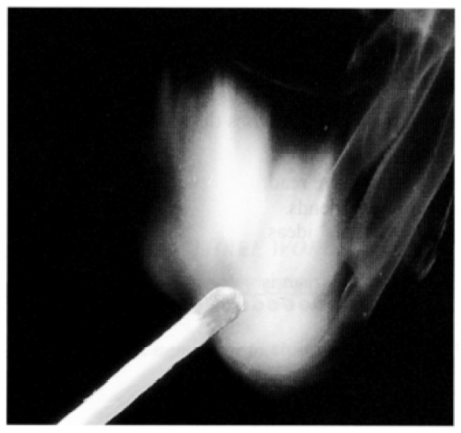

# Cornell Notes

## Topic: A Spark A flint: How Fire Leapt To Life: Reading Answers

## Date: 23/09/2025

---

### Cue Column (Questions, Keywords, or Prompts)

**1. towards** /tɔːrdz/ (pre) [MOVEMENT]: in the direction of, or closer to someone or something
- She stood up and walked towards to him
- He **leaned** (nghiêng người) towards his wife and whispered, "Can we go home soon?"

(pre) [RELATION]: in relation to something or someone:
- They've always been very friendly towards me.
- There has been a change in government policy towards energy efficiency.

(pre) [POSITION]: near to, just before, or around a time or place:
- Our seats were towards the back of the theatre.
- I often get hungry towards the middle of the morning.

(pre) [PURPOSE]: for the purpose of buying or achieving something:
- I'm saving up to buy a car, and Dad has given me some money towards it.
- Would you like to make a contribution (= give some money) towards a present for Linda?

**Grammar:**

- **Verb + towards + noun phrase**: MOVEMENT
  - She walked towards the park.
  - He leaned towards the window.
  - I come towards him and ask for a favor.

- **Verb + towards + gerund (-ing form)** : PURPOSE
  - The company is moving towards reducing costs.
  - They worked towards improving their skills.
  - I am working hard towards paying off my loans.

- **Noun + towards + noun/gerund**: RELATION / PURPOSE
  - His attitude towards women is outdated.
  - Their progress towards achieving their goals is impressive.
  - My efforts towards my goals are valuable.

- **Adjective + towards + noun:** 
  - We use towards with adjectives that describe an attitude, feeling, or behavior directed at someone/something. It emphasizes the **direction of the attitude** rather than just the state.
    - She was **kind towards** the children.
    - He felt **hostile towards** his rivals.
    - She is **angry towards** her partner.
    - She is **sympathetic towards** people in need.
    - The dog is **aggressive towards** strangers.
    - They were **friendly towards** me.
    - The public is **negative towards** the proposal.
  - With adjectives that **show a personal state or simple reaction**, English prefers other prepositions:
    - happy with/about (not happy towards)
    - proud of (not proud towards)
    - afraid of (not afraid towards)
    - interested in (not interested towards)

- **Preposition + towards + noun (less common but possible)**
  - With respect towards your concerns, we’ll revise the plan.
  - By assessing your performance towards company's profit, we decided to keep you with this company.

**2. Compound adjectives:**
- Compound adjectives = **two (or more) words joined together (often with a hyphen) that act as one adjective**.
- They **describe a noun** or appear after a **linking verb**.
  
---

- **Compound adjectives + noun:**
  - A compound adjective always describes a noun (same role as a normal adjective).
  - **Structure:** Compound adjective + noun
  - **Examples:**
    - a life-enhancing book (= a book that enhances life)
    - a well-known actor (= an actor who is well known)
    - a time-saving method (= a method that saves time)

---

- **Compound adjectives + verb (linking verbs):**
  - Adjectives don’t directly attach to verbs. But they can come after a linking verb (be, seem, feel, look, become).
  - **Structure:** Subject + linking verb + compound adjective
  - **Examples:**
    - That experience was life-enhancing.
    - The solution seems time-saving.
    - His attitude is narrow-minded.

---

- **Compound adjectives formed from verbs:**
  - Sometimes you make a compound adjective starting with a verb in -ing or -ed form, often joined with another word:

  - **Verb-ing based:**
    - mind-blowing (= blows your mind)
    - heart-breaking (= breaks your heart)
    - thought-provoking (= provokes thought)
    - slow-burning (= burns slowly, develops gradually)

  - **Verb-ed based:**
    - open-minded (= mind is open)
    - broken-hearted (= heart is broken)
    - sun-dried (= dried in the sun)

---

- **Common Patterns of Compound Adjectives:**

  | Pattern             | Example               | Meaning / Notes                |
  | ------------------- | --------------------- | ------------------------------ |
  | Noun + -ing verb    | life-enhancing book   | enhances life                  |
  | Noun + -ed verb     | man-made lake         | made by man                    |
  | Adj + Noun          | high-speed train      | with high speed                |
  | Adverb + Participle | well-known actor      | known well                     |
  | Number + Noun       | a two-week holiday    | holiday lasting 2 weeks        |
  | Adj + -ing          | good-looking man      | looks good                     |
  | Adj + -ed           | short-sighted view    | lacking foresight              |
  | Noun + Noun         | snow-white dress      | white as snow                  |
  | Prep + Noun         | over-the-counter drug | available without prescription |
  | Noun + Adjective    | world-famous chef     | famous around the world        |

---

- **Key Notes:**
  - **Hyphen rule:** Use a hyphen when the compound adjective comes **before a noun**.  
    - a well-known actor ✅  
    - The actor is well known ❌ (no hyphen needed after a verb).  
  - **Clarity rule:** Always hyphenate when needed to avoid confusion.  
    - a small-business owner (= owns a small business)  
    - a small business owner (= a business owner who is physically small).  

**3. To early man:** in relation to prehistoric humans / from the perspective of prehistoric humans.
- **early man**: humans in prehistoric times (e.g., cavemen, before written history)
- **Examples:**
  - To early man, fire was a source of survival.

**4. Divine** /dɪˈvaɪn/ (adj) [GOD-LIKE]: connected with a god, or like a god:
- The ancient Greeks believed in many divine beings.
- **divine being** Some fans seem to regard the players as divine beings.
- **divine intervention** Instead of trying to change the situation, they simply pray for divine intervention (= help from God).
- **divine right** Just because you've been promoted, that doesn't give you a divine right (= one like that of a god) to tell us all what to do.

**(adj) [SPLENDID]:** extremely good, pleasant, or enjoyable
- We had a perfectly divine time in Switzerland.
- Their new house is quite divine!

**(v) [GUESS]:** to guess something
- *[ + that ]* I divined from his grim expression that the news was not good.
- **divine something from something** Some journalists even tried to divine meaning from the star's body language during the interview.

**(v) [SEARCH]:** to search for water or minerals underground by holding horizontally in your hands a Y-shaped rod or stick, the end of which suddenly points down slightly when water or minerals are below it
- **divining rod** They use forked sticks as divining rods for locating buried treasure and underground water.

**Grammar:**

The word **divine** functions as an **adjective, noun, and verb**.  
It is often literary, formal, or religious in tone.

---
**Adjective: divine** 

**Structures**
- **divine + noun**  
- **linking verb + divine** (be, seem, feel, look, taste, sound, etc.)  
- **noun + of divine + noun** (less common, poetic)

**Examples**
- She believed in **divine intervention**.  
- His voice was simply **divine**.  
- The king claimed a **divine right** to rule.  

**Common Phrases**
- **divine right (of kings)**  
- **divine justice**  
- **divine revelation**  
- **divine presence**  

---
**Noun: the Divine / a divine** 

**Structures**
- **the Divine** (capitalized when referring to God)  
- **noun + of the Divine** (poetic or religious)  
- **a divine** (countable, old-fashioned)  

**Examples**
- She prayed to **the Divine** for guidance.  
- Philosophers debated the **nature of the Divine**.  
- Milton was a great poet and a respected **divine**.  

---
**Verb: to divine**

**Structures**
- **divine + object**  
- **divine + wh-clause**  
- **divine + object + from + source**  
- (archaic/literary) **divine + that-clause**  

**Examples**
- She tried to **divine his true feelings**.  
- He could **divine what the future holds**.  
- They attempted to **divine the answer from the stars**.  
- The prophet **divined that a great flood was coming**.  

**Common Phrases**
- **divine the future**  
- **divine the truth**  
- **divine one’s intentions**  
- **divine answers from [source]**  

---

**Derived Forms & Collocations**
- **divinity (noun)** → state of being divine, or a god/goddess.  
  - *the divinity of Christ, Hindu divinities*  
- **divinely (adverb)** → in a divine manner.  
  - *She sang divinely.*  
- **divination (noun)** → the practice of seeking knowledge of the future by supernatural means.  
  - *ancient divination rituals*  

---
**Tone & Usage Notes**
- **Religious/theological**: divine = of God (divine power, divine law).  
- **Literary/poetic**: divine = heavenly, sublime (divine beauty, divine light).  
- **Everyday informal**: divine = excellent, delightful (That dress looks divine!).  
- **Verb form** is **literary/formal** (synonyms: infer, deduce, guess).  
- **Noun form (a divine)** is **archaic/dated**, rarely used outside historical or literary contexts.  

---
**📌 Quick Summary Table**

| Form | Structure Example                                              | Meaning                   |
| ---- | -------------------------------------------------------------- | ------------------------- |
| Adj  | divine + noun (*divine justice*)                               | holy, heavenly, excellent |
| Adj  | linking verb + divine (*the meal was divine*)                  | delightful, heavenly      |
| Noun | the Divine (*prayer to the Divine*)                            | God / higher power        |
| Noun | a divine (*a learned divine*)                                  | theologian (archaic)      |
| Verb | divine + object (*divine his secret*)                          | guess, discover           |
| Verb | divine + wh-clause (*divine what will happen*)                 | deduce, predict           |
| Verb | divine + object + from + source (*divine the truth from data*) | infer from evidence       |

---

**5. lava** /ˈlɑː.və/ (n) [MOLTEN ROCK]: hot liquid rock that comes out of the earth through a volcano, or the solid rock formed when it cools

**Grammar & Usage**
- Uncountable: you do NOT say "a lava"; use "a flow / a stream of lava".

**Structures**
- molten / flowing / cooling + lava
- lava + flow / field / stream / lake / dome
- be covered in lava | solidify into lava rock

**Collocations**
- molten lava; lava flow; lava field; lava rock; lava tube; lava lake

**Examples**
- The eruption sent molten lava down the mountain.
- Vast lava fields still shape the island's landscape.
- A lava dome formed at the edge of the crater.

**Notes**: Often paired with verbs denoting movement (spew, ooze, pour) and adjectives indicating temperature or viscosity (molten, hot, viscous).

**6. log** /lɑːɡ/
**(n) [WOOD]:** a thick piece of tree trunk or branch, especially one cut for burning on a fire
- He threw another log on the fire.
- The cabin was built from rough pine logs.

**(n) [RECORD]:** a full written or digital record of a journey, activity, system events, etc.
- The engineer checked the error log for clues.
- Keep a daily log of your training sessions.

**(n) [NUMBER]:** logarithm (mathematics)
- In this step you take the log of both sides.

**(v) [CUT WOOD]:** cut down trees for timber
- The company logged the northern slope last winter.

**(v) [RECORD]:** enter information formally or digitally
- Please log each transaction before closing the shift.

**Structures (Noun)**
- a log of + activity (a log of errors / flight log)
- keep / maintain / compile / consult a log
- data / error / flight / ship / access / activity log

**Structures (Verb)**
- log + number/figure (log ten complaints)
- log + object + into system (log data into a database)
- log in / log on (phrasal verb: authenticate)
- log out / log off (end session)

**Collocations**
- fallen log; log cabin; log fire; server log; log entry; log file; log book
- to log hours / results / transactions / progress

**Examples**
- All access attempts are automatically logged.
- They built a shelter from fallen logs.
- Pilots must log their flight hours accurately.
- Users must log in before accessing the dashboard.
- In mathematics: log₁₀ 100 = 2.

**Notes**: Distinguish physical vs. abstract senses. Tech usage: "log file" (not *logging file*). In maths, "log" + base sometimes expressed (log base 10 / log₁₀).

**Existing Phrases**
- **log table** (historical calculation aid)
- **keep a log** maintain a record

**Example (existing)** Family members said he had detailed concerns in the log.
 
**7. alight** /əˈlaɪt/
**(v) [DESCEND]:** (formal) to get out of or off (a vehicle, horse)
- Passengers alighted from the train in silence.
 
**(v) [SETTLE]:** (of a bird/insect/eye/attention) to come down onto something
- A butterfly alighted on the flower.
 
**(v) alight on/upon [NOTICE]:** to find or notice suddenly
- She suddenly alighted upon an elegant solution.
 
**(adj) [BURNING]:** burning; on fire
- Several huts were alight after the storm.
 
**(adj) [ILLUMINATED]:** lit up with emotion or light
- His face was alight with curiosity.

**Structures**

- alight from + vehicle
- alight on/upon + surface / idea
- be alight (no article when adjective)
- alight on a branch / idea / opportunity
- set sth alight (cause to burn)

**Examples**

- A sparrow alighted on the windowsill.
- The bus stopped and several passengers alighted.
- Her eyes were alight with enthusiasm.
- She suddenly alighted upon an elegant solution.
- Several trees were alight after the lightning strike.

**Notes**: Verb is formal/literary. As adjective, usually after a linking verb (The trees were alight). Not used attributively (*an alight building* ❌).

**8. charcoal** /ˈtʃɑːr.koʊl/
**(n) [FUEL]:** a hard, black form of carbon obtained by heating wood without air
- Charcoal burns hotter than seasoned wood.
 
**(n) [ART]:** a stick of this material used for drawing; a drawing done with it
- She displayed three charcoals of coastal scenes.
 
**(adj):** dark gray-black (a charcoal suit)
- He chose a charcoal jacket for the interview.

**Grammar**: Usually uncountable for the substance; countable for a stick or a drawing (two charcoals = two drawings).

**Structures**

- charcoal + fire / grill / burner
- draw (a) charcoal portrait | charcoal drawing
- in charcoal (medium)

**Collocations**

- lump charcoal; charcoal briquettes; charcoal sketch; charcoal gray

**Examples**

- They cooked over glowing charcoal.
- She produced a striking charcoal of the old man.
- He wore a charcoal suit to the interview.

**Notes**: Distinguish "coal" (natural mineral) vs. "charcoal" (processed wood). Same spelling for adjective use.

**9. pot** /pɒt/
**(n) [CONTAINER]:** a round deep container used for cooking, storing, or growing plants
- She stirred the soup in a heavy iron pot.
 
**(n) [PORTION]:** (BrE) a small sealed container (a pot of yogurt)
- He opened a small pot of raspberry yogurt.
 
**(v) [PLANT]:** to put a plant into a pot
- We potted the seedlings after the last frost.

**Structures**

- pot + of + substance (a pot of stew / a pot of paint)
- cooking / clay / coffee / flower pot
- pot + plant (BrE) vs. potted plant (AmE/BrE)
- pot + up (phrasal verb: repot)

**Collocations**

- earthenware pot; stew pot; melting pot (fig.); pot plant; pot lid

**Examples**

- Leave the sauce to simmer in the pot.
- She bought a pot of Greek yogurt.
- We potted the young herbs last spring.
- He opened a small pot of raspberry jam.

**Notes**: Idioms (sample): go to pot (= deteriorate), pot luck (= shared meal / random chance). Verb mainly for planting (and cue sports: pot a ball).

**10. at will** /ət ˈwɪl/
**(adv phrase):** whenever one wishes; without restriction
- After the upgrade, users could export data at will.

**Structures**

- verb + at will (access / produce / move / reproduce at will)
- appear / disappear at will

**Collocations / Typical Pairings**

- produce flame at will; act at will; roam at will

**Examples**

- They could produce electricity at will after the breakthrough.
- The animals roam at will in the reserve.
- Data could be retrieved at will via the new interface.

**Notes**: Formal/neutral; contrasts with earlier dependence on chance. In US employment law, at-will employment is a fixed phrase (separate concept).

**11. tool-making** /ˈtuːl ˌmeɪ.kɪŋ/
**(n):** the process or activity of producing tools
- Tool-making was central to early human innovation.
 
**(adj):** describing species/techniques engaged in making tools
- Tool-making cultures left characteristic debris fields.

**Structures**

- tool-making + techniques / tradition / culture / species

**Collocations**

- advances in tool-making
- early tool-making; stone tool-making; experimental tool-making

**Examples**

- Early tool-making accelerated cognitive development.
- Researchers replicated Neolithic tool-making techniques.
- Tool-making hominins left distinctive flakes behind.

**Notes**: Hyphen retained both as noun modifier and gerund-like noun.

**12. primitive** /ˈprɪm.ə.tɪv/
**(adj) [EARLY]:** relating to an early stage of development; simple; not advanced
- Primitive stone tools were found near the site.
 
**(adj) [BASIC]:** crude, unsophisticated
- They slept in a primitive lean-to made of branches.
 
**(n) (dated / sometimes offensive):** a person from a society perceived (often wrongly) as less advanced
- (dated) The painting depicts "primitives" in an idealized way.

**Structures**

- primitive + tools / technology / methods / society / beliefs
- remain / seem / appear + primitive

**Collocations**

- primitive tribe (avoid in modern anthropology) | primitive instinct | primitive hut | primitive life forms

**Examples**

- They relied on primitive drilling methods.
- Archaeologists uncovered a primitive hearth.
- (dated noun) The text refers to "primitives"—a usage now avoided in academic writing.

**Notes**: Use with caution about people/groups—can carry a negative or outdated tone. Prefer "early" / "pre-industrial" for neutral description.

**13. friction** /ˈfrɪk.ʃən/
**(n) [PHYSICS]:** resistance when two surfaces move against each other
- Less lubrication increased friction in the joint.

**(n) [TENSION]:** conflict or tension between people or groups
- There was growing friction between management and staff.

**Grammar**: Uncountable in both senses (no plural *frictions* in physics; rare figurative plural "frictions").

**Structures**
- friction between A and B
- reduce / increase / overcome friction
- cause / create friction

**Collocations**
- surface friction; air friction (drag); interpersonal friction; political friction

**Examples**
- Friction generates heat in the drilling process.
- Policy changes created friction between departments.
- Reducing surface friction increased rotational speed.
  
**Notes**: Physical sense often pairs with verbs "reduce" / "minimize". Figurative sense overlaps with "tension" and "strain".

**14. peasant** /ˈpez.ənt/
**(n) [HISTORICAL FARMER]:** a small-scale agricultural laborer, esp. in a pre-industrial/feudal context
- Medieval peasants often shared tools communally.
 
**(adj attrib.):** used before a noun (peasant farmers / peasant clothing)
- Peasant households relied on seasonal labor.

**Structures**

- peasant + farmer / family / household
- peasant + uprising / revolt

**Collocations**

- peasant class; peasant economy; peasant revolt; peasant communities

**Examples**

- European peasants preserved embers for kindling.
- The reform altered traditional peasant livelihoods.
- Peasant clothing was coarse yet durable.

**Notes**: Can sound dated or politically loaded. Prefer smallholder / rural farmer where sensitivity needed.

**15. briskly** /ˈbrɪsk.li/
**(adv):** quickly; energetically; with purpose
- The market opened briskly after the announcement.

**Structures**

- move / walk / trade / speak + briskly
- rub / rotate + briskly

**Collocations**

- briskly rotating; briskly walking; briskly rubbing hands

**Examples**

- He rotated the drill briskly between his palms.
- The nurse walked briskly down the corridor.
- Shares traded briskly after the announcement.

**Notes**: Related adjective brisk (a brisk pace / brisk trade). Rarely intensified (*very briskly* uncommon).

**16. palm** /pɑːm/
**(n) [HAND]:** inner surface of the hand
- Sweat gathered in the palm of his hand.
 
**(n) [TREE]:** a palm tree
- A line of palms bordered the shore.
 
**(v):** conceal in the hand (to palm a coin) — advanced / optional
- The magician palmed the card flawlessly.

**Structures**

- the palm of one’s hand
- hold sth in the palm (of your hand)
- palm + tree / oil / frond

**Collocations**

- sweaty palm(s); open palm; palm oil; palm grove; palm leaf

**Examples**

- He pressed the drill between his palms.
- She hid the note in her palm.
- The oasis was ringed with tall palm trees.
- The magician palmed the coin without anyone noticing.

**Notes**: Plural meaning depends on context (palms of hands vs. palm trees). Verb specialised (magic / deception).

**17. wrapping** /ˈræp.ɪŋ/
**(n):** material used to cover or protect something (or the act itself)
- Remove the outer wrapping before heating.
 
**(adj attrib.):** wrapping paper / wrapping film
- She chose gold wrapping paper for the gift.

**Grammar**: Countable for a single piece (a plastic wrapping); uncountable generally.

**Structures**

- remove / tear / strip + the wrapping
- protective / outer / plastic wrapping

**Collocations**

- food wrapping; gift wrapping; tight wrapping

**Examples**

- They removed the protective wrapping before use.
- Gift wrapping is optional at checkout.
- Remove the outer plastic wrapping before microwaving.

**Notes**: Base verb wrap doubles consonant (wrap → wrapping). Use specifically for packaging (not every kind of covering).

**18. cord** /kɔːrd/
**(n) [THICK STRING]:** strong, thick string or thin rope of twisted strands
- He tied the bundle with a length of cord.
 
**(n) [ANATOMY]:** used in compounds (spinal cord, vocal cords, umbilical cord)
- Damage to the spinal cord can impair movement.
 
**(v) (rare):** to bind or pile (cord wood) — specialised
- They corded the firewood behind the shed.

**Structures**

- cord + of + material (cord of hemp)
- tie / pull / wrap + a cord
- extension / power / charging cord

**Collocations**

- extension cord; drawstring cord; braided cord; cotton cord

**Examples**

- They wrapped a cord around the drill to spin it faster.
- The device uses a short charging cord.
- Injury to the spinal cord can cause paralysis.

**Notes**: Distinguish chord (music/math) vs. cord (rope/anatomy). Anatomy: vocal cords (not *chords*).

---

### Notes Section (Main Notes)

**A Spark A flint: How Fire Leapt To Life**

*The control of fire was the first and perhaps greatest of humanity’s steps [**towards**](#towards) a [**life-enhancing**](#compound-adjectives) technology.*

**To early man**, the fire was a [**divine**](#divine) gift randomly delivered in the form of lightning, forest fire, or burning [**lava**](#lava). Unable to make flame for themselves, the earliest peoples probably stored fire by keeping [**slow-burning**](#compound-adjectives) [**logs**](#log) [**alight**](#alight) or by carrying [**charcoal**](#charcoal) in [**pots**](#pot).

How and where man learned how to produce flame [**at will**](#at-will) is unknown. It was probably a secondary invention, accidentally made during [**tool-making**](#tool-making) operations with wood or stone. Studies of [**primitive**](#primitive) societies suggest that the earliest method of making fire was through [**friction**](#friction). European [**peasants**](#peasant) would insert a wooden drill in a round hole and rotate it [**briskly**](#briskly) between their [**palms**](#palm). This process could be speeded up by [**wrapping**](#wrapping) a [**cord**](#cord) around the drill and pulling on each end.

The Ancient Greeks used lenses or concave mirrors to concentrate the sun’s rays and burning glasses were also used by Mexican Aztecs and the Chinese.

Percussion methods of firefighting date back to Paleolithic times, when some Stone Age tool-makers discovered that chipping flints produced sparks. The technique became more efficient after the discovery of iron, about 5000 years ago In Arctic North America, the Eskimos produced a slow-burning spark by striking quartz against iron pyrites, a compound that contains sulfur. The Chinese lit their fires by striking porcelain with bamboo. In Europe, the combination of steel, flint, and tinder remained the main method of firefighting until the mid 19th century.

Fire-lighting was revolutionized by the discovery of phosphorus, isolated in 1669 by a German alchemist trying to transmute silver into gold. Impressed by the element’s combustibility, several 17th-century chemists used it to manufacture fire-lighting devices, but the results were dangerously inflammable. With phosphorus costing the equivalent of several hundred pounds per ounce, the first matches were expensive.

The quest for a practical match really began after 1781 when a group of French chemists came up with the Phosphoric Candle or Ethereal Match, a sealed glass tube containing a twist of paper tipped with phosphorus. When the tube was broken, air rushed in, causing the phosphorus to self-combust. An even more hazardous device, popular in America, was the Instantaneous LightBox — a bottle filled with sulphuric acid into which splints treated with chemicals were dipped.

The first matches resembling those used today were made in 1827 by John Walker, an English pharmacist who borrowed the formula from a military rocket-maker called Congreve. Costing a shilling a box, Congreves were splints coated with sulphur and tipped with potassium chlorate. To light them, the user drew them quickly through folded glass paper.

Walker never patented his invention, and three years later it was copied by a Samuel Jones, who marketed his product as Lucifers. About the same time, a French chemistry student called Charles Sauria produced the first “strike-anywhere” match by substituting white phosphorus for the potassium chlorate in the Walker formula. However, since white phosphorus is a deadly poison, from 1845 match-makers exposed to its fumes succumbed to necrosis, a disease that eats away jaw-bones. It wasn’t until 1906 that the substance was eventually banned.

That was 62 years after a Swedish chemist called Pasch had discovered non-toxic red or amorphous phosphorus, a development exploited commercially by Pasch’s compatriot J E Lundstrom in 1885. Lundstrom’s safety matches were safe because the red phosphorus was non-toxic; it was painted onto the striking surface instead of the match tip, which contained potassium chlorate with a relatively high ignition temperature of 182 degrees centigrade.

America lagged behind Europe in match technology and safety standards. It wasn’t until 1900 that the Diamond Match Company bought a French patent for safety matches — but the formula did not work properly in the different climatic conditions prevailing in America and it was another 11 years before scientists finally adapted the French patent for the US.

The Americans, however, can claim several “firsts” in match technology and marketing. In 1892 the Diamond Match Company pioneered book matches. The innovation didn’t catch on until after 1896 when a brewery had the novel idea of advertising its product in matchbooks. Today book matches are the most widely used type in the US, with 90 percent handed out free by hotels, restaurants, and others.

Other American innovations include an anti-afterglow solution to prevent the match from smouldering after it has been blown out; and the waterproof match, which lights after eight hours in water.

---

### Summary Section (Summary of Notes)

[190+ IELTS ACADEMIC READING PRACTICE TESTS 2025](https://ieltsprogress.com/ielts-academic-reading-practice-tests/)

``
