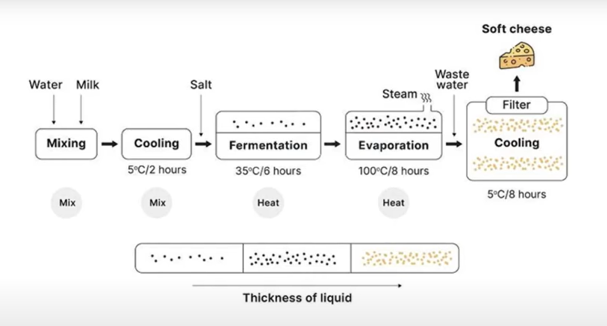

# WRITING TASK 1+2

## Source: [Giải full process Task 1 + Task 2 đề IELTS ngày 23/8 | THE FORUM CENTER](https://www.youtube.com/watch?v=criARuQzuak&t=8s)

### Date: 24/08/2025
---

**I. Task 1**

**Thach:** The process provides information about the steps that need to be taken to produce soft cheese. Overall, the entire procedure contains two main phases, from the preparation of raw milk and the initial fermentation to the rapid changing of temperature in order to achieve the desired physical states of soft cheese

First, milk and water are mixed together. The temperature of this mixture is then deliberately decreased, stabilizing at a level of 5 degrees Celsius for a prolonged period of two hours. The addition of salt to this mixture is followed by a phase of fermentation where bacteria would change the chemical and physical characteristic of milk, requiring a temperature of 35 degrees Celsius in six hours. At this stage, the mixture still resembles a liquid. After this stage, the water content that is in the mixture is partially removed thanks to a phase of evaporation that keeps the liquid at a boiling temperature in eight hours. At this point, there is an increase in the level of thickness of this mixture. The procedure requires the removal of the waste water - an unwanted product of this cheese-making process - before the temperature is reduced significantlly again. This plunge in temperature to 5 degrees Celsius lasts another eight hours, eventually creating soft cheese that is ready for consumption or further production.

**II. Task 2**

**Government money should be used to support children in school for sports rather than to support professional sports and arts that perform for the general public.**

**To what extent do you agree or disagree?**

**1. Opening:** Viết lại đề sau đó trả lời câu hỏi 1 cách ngắn gọn

**Thach:** Government grants should be invested in sports for kids in educational organizations instead of professional sports and arts which are used for general entertaining purposes for society. Personally, I partly agree with this suggestion based on some reasons that are explained in this essay.

**Huy Forum:** Some people think that investing in helping children in school get access to sports should be done by the government rather than supporting professional athletes or artists who perform for the mass public. Personally, I totally/partly agree/disagree with this suggestion based on some reasons that are explained in this essay.

**2. Main**

On the one hand, it is true that sporting activities are extremely essential for children since being active physically can help them avoid being overweight, which can lead to many chornic health issues, such as obesity or diabetes. As a result, investing in sports facilities for children in school can potentially prevent a large amount of expenses for medical purposes, benefiting both citizens and society. In contrast, mass performers are directly a beneficiary of the cost of ticket that audiences must pay, which helps them sustain their lives and motivate them to continue contributing.

On the other hand, sports and arts are not universally appealing to the general public, and the ones that can actually attract attention and generate revenue comprise only a fraction of all types of sports and arts. Without the financial attention from the government, athletes or performers would not be able to sustain their lives, leading to a waning popularity and eventually causing dying out of these activities.