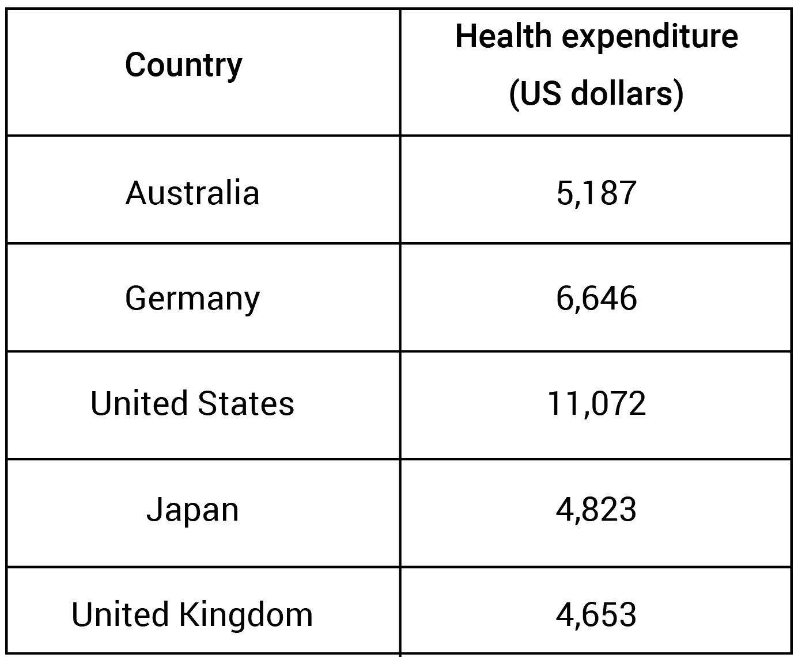

# WRITING TASK 2

## Source: [IELTS Writing actual tests](https://study4.com/tests/4779/practice/?part=11893)

### Date: 14/09/2025
---

**The table shows the information of total health expenditure per capita in five countries in 2019.**

**Summarise the information by selecting and reporting the main features, and make comparisons where relevant.**

The given table depicts the amount of money spent for health matters per capita which was recorded in five countries Australia, Germany, United States, Japan and United Kingdom in 2019. Overall, United States occupied the first position with the highest expenditure and United Kingdom was considered to gain the least money from health area.

In terms of United States, where had the highest number of money to be spent for health, which was 11,072 US dollars given for this section. Right behind it is Germany, an individual used 6,646 US dollars for taking care of their health. Along with Australia, 5,187 US dollars was used in healthcare system, which was a little lower than Germany with unconsiderable amount. Additionally, Japan and United Kingdom shared comparatively approximate number of expenditure of a citizen on health system, which were correspondingly 4,823 and 4,653 US dollars in the same period.

**Advance version:**

The table compares per capita health expenditure in five countries (Australia, Germany, the United States, Japan and the United Kingdom) in 2019. Overall, the United States spent by far the most per person on health, while the United Kingdom recorded the lowest per-capita spending; Germany and Australia were in the mid-range and Japan's figure was close to **that of** the UK.

In 2019 the United States spent $11,072 per person on health, **considerably more than any other country**. Germany was the second highest at $6,646 per capita, around $4,426 less than the US. Australia followed with $5,187 per person, some $1,459 below Germany.

Japan and the United Kingdom had similar, lower levels of expenditure: $4,823 and $4,653 per capita respectively, a **difference of** only $170. Both countries spent several hundred dollars less than Australia and **around half of** the US level.