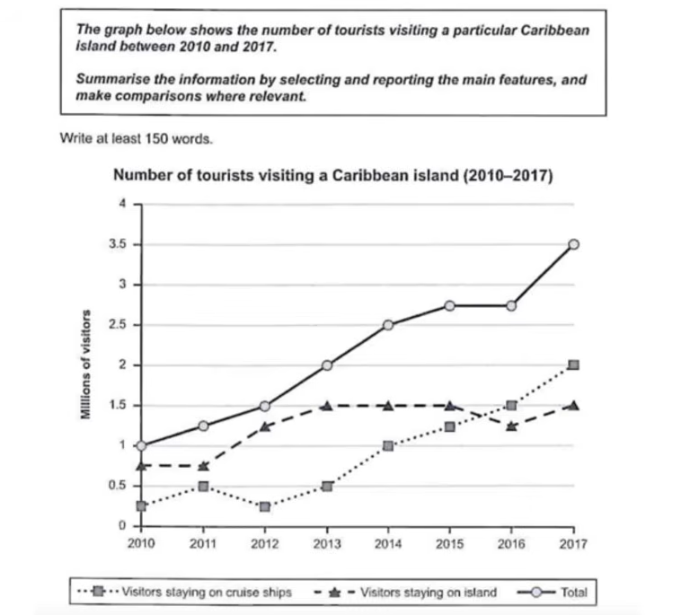
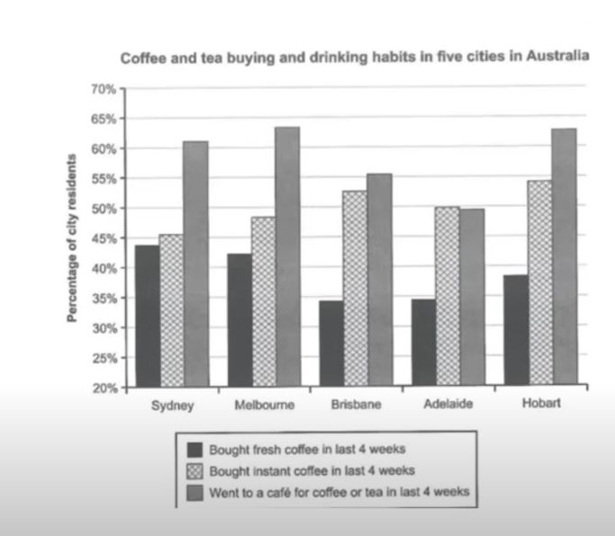
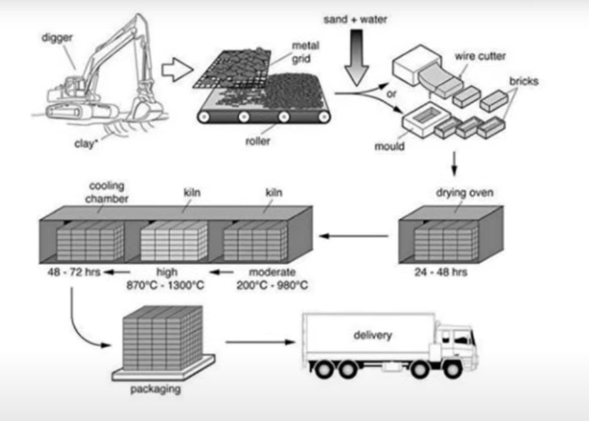
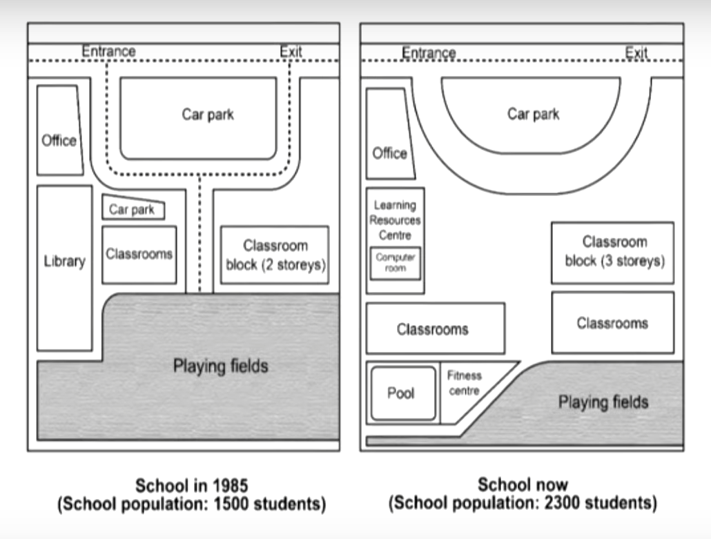

<h1 align="center"><strong>TASK 1 RULES</strong></h1>

- Cái quan trọng là overview
  - Phải cover dc main trends or main differences -> Đạt được 7/9 T.A

**1. Line Chart - Time factors**

**Introduction**: Viết lại đề 

**Overview**: Main trends/differences.

**Main parts**: Cover all key features.

**Đề bài:**

- Cruise ships - 2010 - around 250 thousands

Tiếp cận với con số này bằng 3 cách:
- **Dùng con số làm chủ ngữ:** In 2010, ảound 250000 individuals who visited this island stayed on a cruise ships during their trips.
- **Dùng tên đồ thị làm chủ ngữ:** In 2010, cruise ships were chosen to be the accommodation of around 250000 individuals who traveled to this island.
- **Dùng modifier:** **The number of** visitors who traveled to this island and stayed on a cruise ship was around 250000.

**Kỹ thuật:**

**Tendency:** 2010 - cruise ships - around 250000 / 2011 - 500000

**Version 1:** The number of tourists who stayed on a cruise ship during their trips to this island increased from 250000 in 2010 to 500000 in 2011

**Version 2:** In 2010, only around 250000 visitors who traveled to this island stayed on a cruise ship. However, the number increased steadily to 500000 only one year after.

---

**Chiến thuật:**

Đối với bài có yếu tố thời gian. Phần overview **chỉ mô tả xu hướng** (từ đầu cho tới cuối), còn **thứ hạng của tụi nó** (cái nào cao hơn cái nào) sẽ bỏ vào trong phần main.

**Làm bài:**

**1. Opening:**

The line chart provides information about the number of tourists who wen to a certain Caribbean island and chose between two different accommodation types from 2010 to 2017. Overall, the numbers of visitors staying on a cruise shipe or on the island had increased significantly over the time, resulting in a massive leap in the number of tourists visiting this location.

**2. Main**

**Mô tả island trước - nên tả hết những điểm hay tả cái gì**
- 2010/2011 stable -> Optional
- 2013 - 2014 - 2015 -> đỉnh cao nhất 1.5m
- 2016 -> giảm nhẹ
- 2017 trở lại đỉnh

**Version 1:** The number of visitors who traveled to this island and stayed on it stabilized at around 750000 in the first two years before increasing to a peak of 1.5 million in 2013, 2014, and 2015. After experiencing a slight decrease of around 250000 in 2016, it increased back to the previous peak in 2017.

**Version 2:** In the first two years, around 750000 visitors stayed on the island during their trips. The number then increased steadily to a peak of 1.5 million in 2013 and stayed at this level until 2015. Although it slightly decreased in 2016, it surged back to the previous peak in 2017.

**Version 3:** In 2011 and 2012, this island welcomed around 750000 visitors who decided to stay at a location on this island. However, this type of accommodation had its popularity increased afterwards, as in 2013, and the next two years afterwards, 1.5 million visitors stayed on it. In 2016, it decreased from this peak before picking up the increasing momentum again in 2017.

**Mô tả cruise ship:**
- 2010 (250000)
- 2011 (500000)
- 2012 (250000)
- 2017 (2 million) (chú ý, từ sau 2016, thì cruise ships trở nên popular nhất so với việc ở trên island)

**Version 1:** The number of visitors to this island who settled on a cruise ship during their trips increased from 250000 to 500000 between the first two years before plunging back to the starting level in 2012. The popularity of staying on a cruise ships rocketed afterwards, as in 2017, around 2 million passengers chose this accommodation type, surpassing the number of individuals who stayed on the island.

**Version 2:** After fluctuating between 250000 to 500000 in the first three years of this period, the number of visitors who chose cruise ships surged consistently in the next five years, eventually peaking at 2 million in 2017. Remarkably, the popularity of this accommodation type surpassed the preference for staying on the island in the last two years

**Version 3:** From 2010 to 2012, around 250000 to 500000 individuals chose a cruise ship to stay during their trip; nevertheless, the number soared exponentially and eventually surpassed the figure for people staying on the island. In 2017, a whopping 2 million individuals settled on a cruise ships for their trip to this location.

**Mô tả total:**

Thanks to the massive increases in the number of visitors for choosing both types of accommodation, the total number of passengers to this island had jumped impressively from only 1 million in 2010 to 3.5 million in 2017, constituing a more than 3-folds surge.

---

**2. Bar charts**

**Overview:** Overall, instant coffee was more popular than its fresh counterpart based on the percentage of residents who purchased each of them in the past one months in all the surveyed cities. 

- Sydney - around 44% - fresh coffee in the last four weeks

**Sẽ có 2 cách để tiếp cận:**
- **Sử dụng con số làm chủ ngữ**: In Sydney, around 44% of individuals living in this city purchased fresh coffee in the last four weeks.
- **Modifier:** The percentage of people who lived in Sydney and purchased fresh coffee in the last four weeks was around 44%

---

**Chiến thuật:** Cách nào chia ra số khổ ít nhất thì mình sẽ nhìn cái hình theo cách đó

**Fresh coffee:**
- Sydney and Melbourne: 42% - 44%
- Hobart: around 38%
- Brisbane Adelaide: 35%

In Sydney and Melbourne, around 42% to 44% of residents living in these cities purchased fresh coffee in the last four weeks, making them the highest numbers compared to the three remaining cities. The percentage of individuals in Hobart buying the same product in this timeframe was slightly lower, with 38%. In both Brisbane and Adelaide, around more than one-third of all citizens purchased this coffee version in the last four weeks.

**Instant coffee:** 
- Brisbane / Hobart: 52% to 54%
- Adelaide: 50%
- Sydney and Melbourne: 45 - 58%

The percentage of individuals living in Brisbane and Hobart who purchased instant coffee in the past four weeks were from 52% to 54%, the highest among all other cities. The rate was slightly lower for Adelaide with 50%, while around 45% to 48% of citizens in Sydney and Melbourne had this type of purchase in the surveyed timeframe.

**Went to a cafe for coffee or tea**
- Melbourne and Hobart: 63%

Around 63% of residents living in Melbourne and Hobart went to a coffee shop for coffee and tea in this past one month, the highest number among the figures for the remaining cities.

---

**3. Process**

The process provides information about the steps that need to be taken to produce bricks. Overall, the entire procedure consists of three main phases, including the extraction of raw materials and shaping the bricks, applying heat on them, and delivery and packaging.

**Paragraph 1:**

**Version 1:** In the first step, a digger extracts clay from the ground. The extracted clay is then sifted on a metal grid before falling on a roller. The sifted clay is then mixed with sand and water before being shaped into bricks using either a wire cutter or a mould.

**Version 2:** The first step begins with the extraction of clay from the ground using a digger. This extracted clay is then sifted to ensure consistency as a metal grid breaks down clumps in the clay. The sifted clay is then conveyed on a roller before being mixed with sand and water and taken on shape of brick using either a mould or a wire cutter.

**Paragraph 2:**

**Version 1:** These freshly shaped bricks are then dried in a drying oven from one to two days.

**Version 2:** A process of dehydration occurs in the next stage as the freshly shaped bricks lose their water content in a drying oven from one to two days.

The dehydrated bricks are then heated in two different kilns. The first one employ a moderate level of heat, ranging from 200 to 980 degree Celsius, while the second one uses a much higher level from 870 to 1300 degree Celsius. In the second kiln, the color of the bricks takes on a much brighter hue. After being heated, the bricks are then allowed to cool down in a cooling chamber from two to three days.

**Paragraph 3:**

In the last stage, the bricks are then packaged into large prism blocks before being transported to consumers by a truck.

---

**Version without advanced vocabularies**

In the first stage, clay is extracted from the ground by a digger before being sifted on a metal grid. The clay breaks down and is conveyed on a roller before it is mixed with sand and water. This mixture eventually takes on the shape of bricks by using a mould or a wire cutter.

The second stage begins with the dehydration of freshly shaped bricks in an oven from one to two days. They are then treated by heating in two kilns. The first one has a temperature level from 200 to 980 degrees Celsius, while the second one utilizes a higher level of 870 to 1300 degrees Celsius. In the last chamber, the bricks are left to cool down from two to three days.

In the last steps, the bricks are then packaged together before being transported to consumers by a truck.

---

**4. Maps**

**Overview:**

Overall, a prominent area at the bottom of the map has its size reduced to accommodate more teaching facilities. Also, a conventional teaching facility on the left side of the map has been upgraded with modernized equipment.

One of the most remarkable changes in the map is that the playing fields have their sizes reduced by roughly 50%. This reduction allows the construction of a classrooms block, a pool, and a fitness center on the left side. On the right side, a new storey has been added to the existing block, while another block has been built closer to the playing fields.

Importantly, the library and its surrounding components have also changed drastically. This learning facility has become a learning resources center with a built-in computer room.

The car park has also been altered. Its shape has changed from being rectangular to more globular. while the middle route previously connecting it with the playing fields has been removed.

